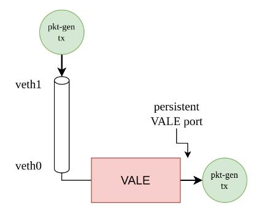

# VALE-docker - Docker Plugin for netmap-enabled CNFs

Simple network plugin for Docker Engine that enables netmap on containers.

It uses veth interfaces to connect containers to the host network, and [vale](https://www.freebsd.org/cgi/man.cgi?query=vale&sektion=4&n=1) switch to connect containers to each other.

The code of the driver is forked from [jacekkow/docker-plugin-pyveth](https://github.com/jacekkow/docker-plugin-pyveth).

The idea behind this plugin is similar to what the default bridge driver does, but instead of using a an in-kernel bridge as a layer 2 switch, it uses a netmap enabled switch (vale). Note also that the veth pairs are set in netmap mode.


However, there is some caveat regarding container networking using netmap. Non-netmap applications running inside the container are forced to use the netmap generic adapter —a driver that is used to access any NIC without native netmap support at reduced performance—. That leads to a significant loss in performance in terms of speed —packets processed per second—. In the use case for which this was developed, it is not wanted that CNFs use the netmap API —see Figure \ref{fig:overall_system_design}—.  That is, applications inside the containers are forced to use the kernel network stack —no netmap involved— in one side of the `veth`. Hence, on the VALE switch side of the `veth` pair, the generic adapter must be used forcefully.

we can do a quick experiment to analyze this issue:



* If using **netmap-patched** `veth`
  * Getting around **12 Mpps**.
  * But we are forced to use the netmap API in both sides of the `veth` pair.
* If using **netmap generic adapter**
  * Getting **1.2 Mpps** using `pkt-gen`, i.e., netmap in both sides of the `veth` pair.
  * Getting **less than 1 Mpps** using the kernel netowrk stack to send through `veth1`.
    * But we can use the socket API in one side of the `veth` pair and use netmap on the other side.

## Plugin Workflow


## Installation

```bash
sudo cp vale_docker.json /etc/docker/plugins
docker-compose up
```

## Test

Run two containers: one as a trafic generator (`txc`) and one as a traffic sink (`rxc`).

```bash
docker-compose -f simple-netmap-sender.yml up
```
